# Keyhole

By WitherOrNot  
Edited by May, Lyssa, & SpCreatePackaedLicense

## Introduction

In our ongoing work to bypass Windows licensing checks, we occasionally stumble upon bugs that we choose to keep secret. This decision allows us to preserve potential future activation methods by avoiding bug fixes, while also giving us valuable tools for testing or developing new methods. 

One such discovery, which we've named "Keyhole", turned out to be a highly effective DRM bypass. It gave users the ability to license any Microsoft Store app or any modern Windows edition with ease.

<!-- truncate -->

Following the disclosure of [CVE-2024-38184](https://msrc.microsoft.com/update-guide/vulnerability/CVE-2024-38184) by [Cisco TALOS](https://talosintelligence.com), we have decided to share our findings on Keyhole, which we independently uncovered around the same time it was reported to Microsoft.

## CLiP

To understand this exploit, we must first understand CLiP, the Client Licensing Platform. This system was introduced with Windows 10, primarily as a way to implement DRM for Microsoft Store apps, and integrated with Windows activation, allowing users to buy digital licenses for Windows on the Microsoft Store.

CLiP is comprised of a few different main binaries within Windows:
 - `clipup.exe` - Migrates (converts) Windows 8 store licenses, genuine tickets, and product keys to digital licenses
 - `clipsvc.dll` - User-mode service responsible for managing app licenses
 - `clipc.dll` - API used by applications to interact with CLiP
 - `clipwinrt.dll` - Similar to `clipc.dll` but for UWP applications utilizing [Windows Runtime](https://learn.microsoft.com/en-us/windows/uwp/winrt-components).
 - `clipsp.sys` - Kernel-mode driver responsible for verifying licenses

Whenever a CLiP-licensed app is installed, a signed XML file containing the license information is sent to `clipsvc.dll`; once the XML signature is verified, the XML data is stored in ClipSVC's "physical store" at `%PROGRAMDATA%\Microsoft\Windows\ClipSVC\tokens.dat`. 

The signed license block is then extracted from the `SPLicenseBlock` tag and sent to `clipsp.sys` for verification. After verification, the license block is deposited in the CLiP license store at `HKLM\SYSTEM\CurrentControlSet\Control\{7746D80F-97E0-4E26-9543-26B41FC22F79}`. From there, `clipsp.sys` can then re-validate the license in the future if an app requests it using the CLiP API.

:::note

The CLiP license store mentioned earlier is protected so that you can't view it by default, but changing the permissions to allow yourself access is very easy.

:::

As designed, this system forms a rather strong chain-of-trust that transmits only signed data from usermode applications all the way to the kernel, making it seemingly difficult to tamper with. As we will see soon, however, this is not at all the case.

## A Little Trolling

So far, one binary failed to receive any mention: `clipup.exe`. This is because it isn't notable when talking about Keyhole itself. However, it holds the key to messing with CLiP:

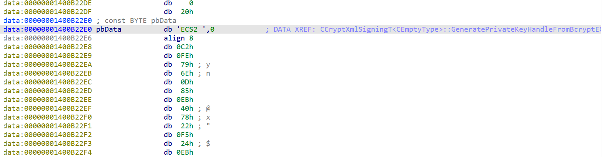

Yes, literally. A valid ECDSA key to sign XML licenses is stored in unobfuscated form, allowing anyone to very easily sign or resign XML licenses. This key is normally meant to sign temporary licenses sent to the Microsoft store to get digital licenses, but ClipSvc will happily accept it for app licenses as well. 

This allows us to bypass ClipSvc's gatekeeping and effectively send any license blocks we want straight to ClipSp. With this, we entirely bypass the usermode level of the chain-of-trust, and now all that's left is to try and trick ClipSp.

## Unpacking ClipSp

ClipSp, from our analysis, is not a very well-written driver. It's full of copy-pasted code (from where will be shown soon), and seems to be rife with odd choices and compromises. In other words, it's a perfect environment for someone looking for a bypass. There's only one big issue: most of the interesting driver code is hidden using Microsoft's proprietary obfuscator, known as Warbird. In order to find and understand it, we need to "unpack" it, a.k.a. undoing the obfuscation. Luckily, this is rather straightforward thanks to some symbols for `clipsp.sys` that were available on Microsoft's servers.

Similar to how Warbird works [in user-mode programs](https://github.com/WitherOrNot/warbird-docs), ClipSp wraps any calls to obfuscated code with an decryption and encryption function, as shown below:

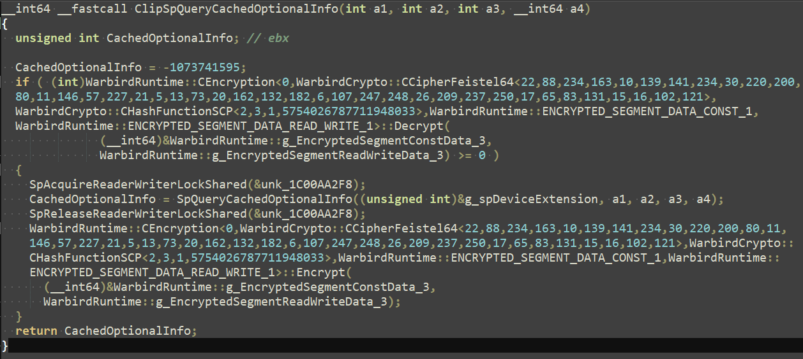

So, if we can manually run these decryption functions, we could access all of the hidden code. Luckily, this is quite simple to do based on a method [by KiFilterFiberContext](https://github.com/KiFilterFiberContext/warbird-hook), and with it, we are now able to finally find some bugs.

## License Blocks

License blocks, mentioned previously, are what actually hold the important license information in CLiP. Their format is [well-documented](https://github.com/LukeFZ/CikExtractor) and can store many kinds of data, so we figured they were a good place to start looking for bugs.

License blocks hold their data in a tag-length-value (TLV) format, where several smaller blocks are stored together with each holding values for their data type, the length of their data, and the data itself. For example, the TLV block highlighted below has a type of `0xC9` (License Information), a length of `0xA` (10 bytes), and 10 bytes of data.

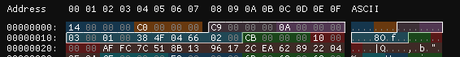

At the very end of a license block, there will always be a signature block, with a type of `0xCC`. This block holds the signature of all the data before it, as well as indicating which key it was signed with. And of course, since it sits after all the data being signed, there's no way to alter any of it... right?

## A Lot of Trolling

In the middle of experimenting with this data format, one of our members, May, had a very simple question. If the signature block signs all the data before it, what happens to the data put after it?

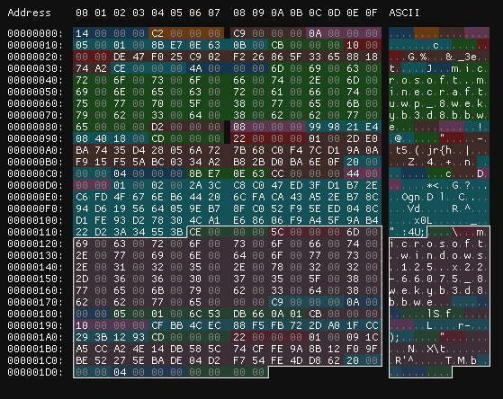

Above, you can see a license block for Minecraft Bedrock edition with some new data placed after it (highlighted), containing blocks copied from a Windows license. What happens if we try to install such a license?

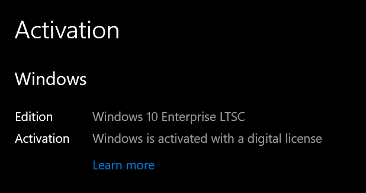

As it turns out, data after the signature block isnt checked at all... and it can even override data that came before it. Whenever two blocks of the same type are stored together, the last one overrides all the others before it. So, if we want to change any license data, we can just make a block for it and put it after the signature block!

This method lets us make licenses for anything sold on the Microsoft Store, including Windows, from any other Microsoft Store license. And since there are so many free apps with licenses, we now had the ability to make as many as we wanted for whatever we wanted. This bug essentially punched a hole straight through CLiP's DRM, so we decided to name it "Keyhole".

There is only one catch: licenses that are bound to a specific device, known as "device-locked" licenses, cannot be made from device-unlocked licenses. Since Windows digital licenses are device-locked, this meant that we needed to make them from device-locked app licenses. Luckily, many apps, including games like Roblox fit this criteria.

## Trolling Tutorial

The steps to make any Windows license you want were now dead simple. First, install an app with a device-locked license, like Roblox.

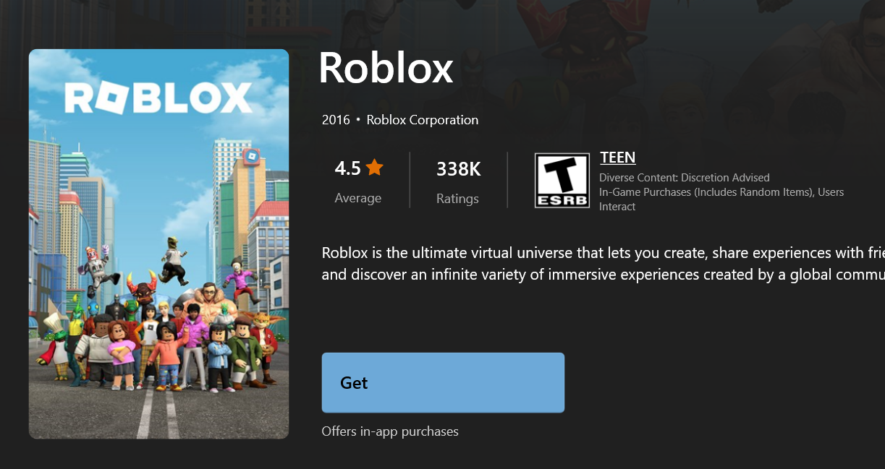

Then, using a HTTPS traffic capture tool like Fiddler, intercept the license that comes from `https://licensing.mp.microsoft.com/v7.0/licenses/content`.

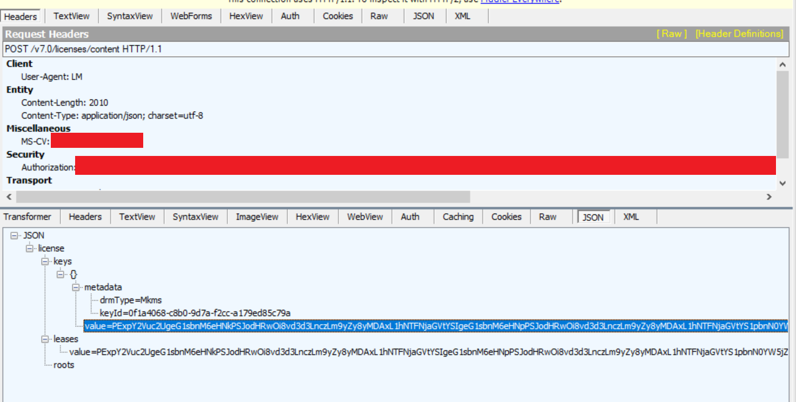

Decode the license, then extract its license block.

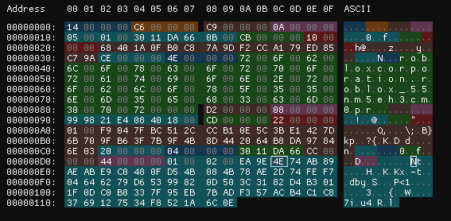

Now, add whatever new data you need to make a new license.

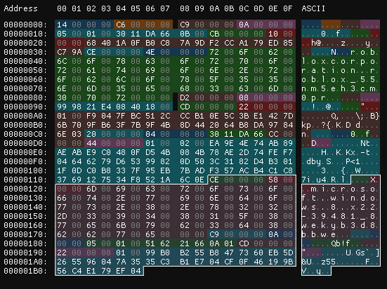

Then, we just package our license block into a new XML file, sign the XML, and copy it into the folder `C:\ProgramData\Microsoft\Windows\ClipSVC\Install\Migration`.

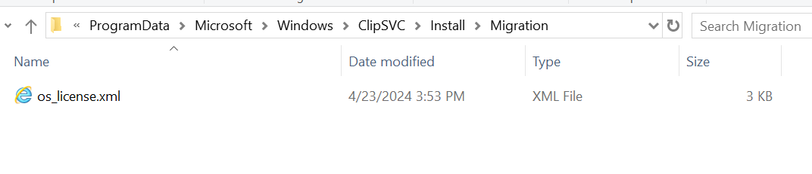

Finally, we get ClipSvc to install our license, either by restarting it, or with the command `clipup -p`.

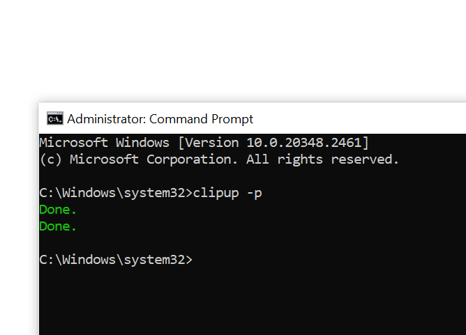

When we check our activation status, Windows is now permanently activated.

With this, we were able to do things that were previously impossible, like activating Enterprise LTSC with a digital license, or even activating a legitimate KMS server with a generic key:

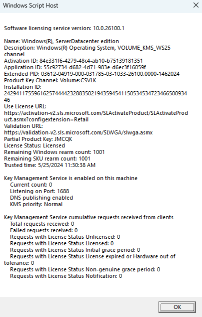

From here, it's pretty easy to see that this simple bug completely annihilates CLiP's DRM system.

## Buzzkill

Having found this bug, we were quite happy that CLiP was now effectively dead. This happiness didn't last very long, though, as we recently found a [vulnerability report](https://talosintelligence.com/vulnerability_reports/TALOS-2024-1964) from Cisco TALOS that reported this exact bug. It was reported to Microsoft on April 8, right around when we first found it.

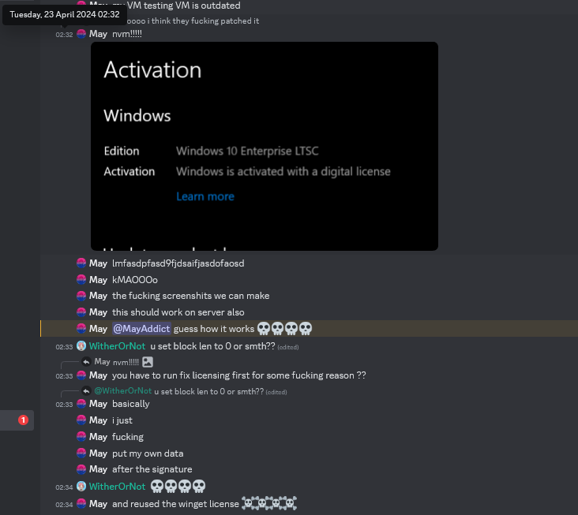

For some reason beyond us, they reported it as a "privilege escalation", even though editing CLiP licenses does little to grant an attacker more access to a system. As we view it, this was just an excuse for TALOS to report this DRM bug along with [other more serious bugs in ClipSp](https://talosintelligence.com/vulnerability_reports/TALOS-2024-1988).

What did they get out of this? We have no idea, and seemingly it looks like they didn't get anything in return, aside from a minor credit in the [August 2024 update release notes](https://msrc.microsoft.com/update-guide/releaseNote/2024-Aug). So, to Philippe Laulheret who reported this bug, I hope you feel good about ruining our fun for a 4-months-late pat on the back.

As for the fix itself, it's rather straightforward. As shown below, the current license block parser code immediately exits after encountering a signature block. This prevents it from processing blocks after the signature, completely patching Keyhole. 

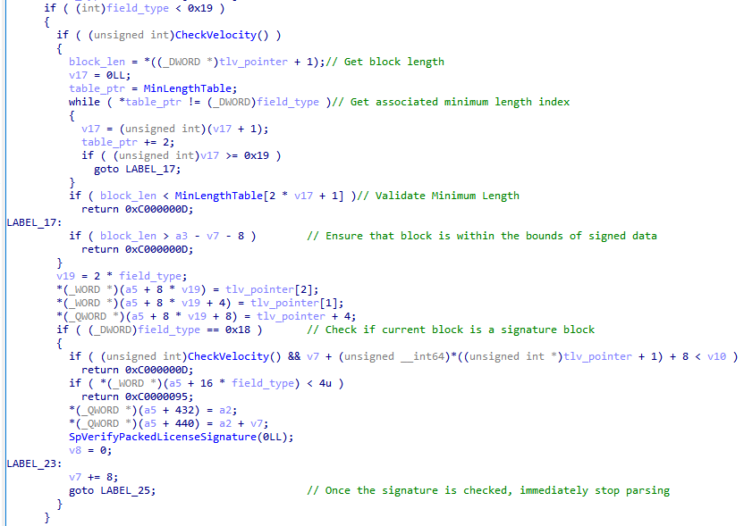

## Giving Season

After mourning the loss of our beloved exploit, we decided that it would only be fair to publicize our own discoveries on CLiP. So, we've released the code to [generate Keyhole licenses](https://github.com/massgravel/keyhole) and our [collection of CLiP binaries](https://archive.org/details/clipwinrt) with symbols for easier analysis. We invite you to go forth and discover more funny things in CLiP! (and [report them to us](https://massgrave.dev/contactus) instead of MS)

## And now, for something different

I mentioned that ClipSp's buggy code was copy-pasted, but from where? Well, the "SP" part just happens to reference a certain Microsoft game console: the Xbox One!

The Xbox One contains a chip known as the SP, or "secure processor", based on the TPMs in modern PCs. The main job of the SP is to enforce code signing, but it also handles license verification. During our research on Keyhole, we found many associations between CLiP and the Xbox One, and began wondering how they were actually related. While looking through some leaked source code, we stumbled upon this:

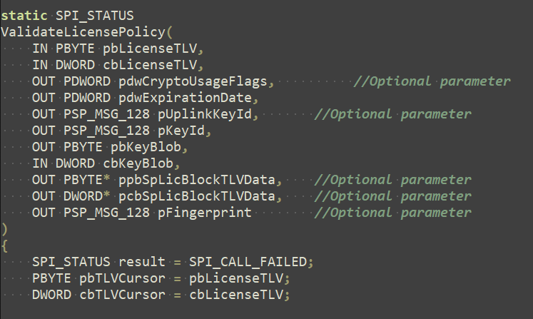

Well, this looks oddly familiar...

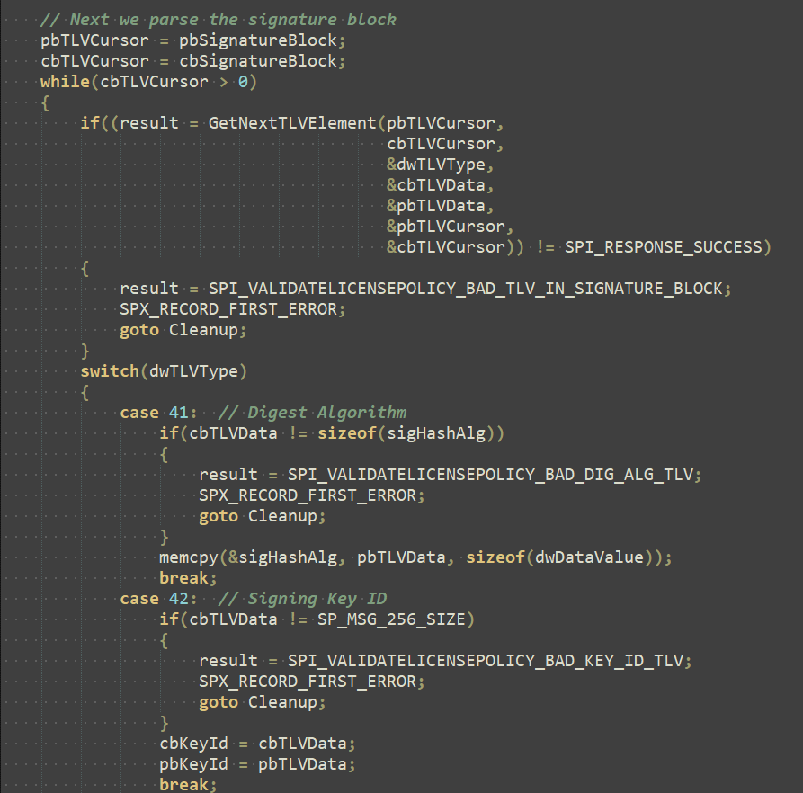

And there's the same bug that's in CLiP, but in Xbox code. In fact, we weren't too surprised to find this, as we found that almost all of CLiP, from the XML format of the licenses to the TLV-based license blocks, is copy-pasted straight from the Xbox One's DRM system.

So, to those with a console that's been [collaterally damaged](https://github.com/exploits-forsale/collateral-damage), I wonder what happens if you mess with those funny-looking XML files in `S:\clip` ;)

## Credits

The research covered in this blogpost was made possible by the following people/groups:

 - May - Initial discovery, testing, reverse engineering
 - asdcorp - Testing, reverse engineering
 - SpCreatePackaedLicense - Testing, reverse engineering, bugfix analysis
 - WitherOrNot - Tool development, testing, reverse engineering, bugfix analysis
 - emoose, LukeFZ - License Block format documentation
 - KiFilterFiberContext - ClipSp unpacking
 - Phillippe Laulheret, Cisco TALOS - Inspiring this publication
