# TSforge: Gaslighting a DRM system

By WitherOrNot  
Edited by May

## Introduction

2025 marks nearly 20 years since the introduction of Windows' current DRM system, the Software Protection Platform (SPP). With it serving as the primary gateway to activation since [early in Windows Vista's development](https://betawiki.net/wiki/Windows_Vista_build_5212_(winmain)), many have come up with clever ways of tricking it, from [resetting grace period timers](https://www.mydigitallife.net/activate-64-bit-windows-vista-ultimate-and-x64-with-timerstop-v2a-crack-plus-2099-trick/) to [emulating KMS servers](https://forums.mydigitallife.net/threads/kmsemulator-kms-client-and-server-emulation-source.41010/) to [hooking bootloaders](https://forums.mydigitallife.net/threads/windows-loader-download.58464/). While all of these systems abuse various activation methods, there has never been an exploit that directly attacked SPP itself... until now.

<!-- truncate -->

In this blogpost, we introduce [TSforge](https://github.com/massgravel/TSforge), one of our most powerful activation exploits ever. Capable of activating every edition of every version of Windows since Windows 7, as well as every Windows addon and Office version since Office 2013, TSforge is both the most complex and most wide-reaching exploit we've implemented in MAS to date, rivaled only by our ill-fated [Keyhole](https://massgrave.dev/blog/keyhole) exploit. Aside from discussing how TSforge works, I'll also be discussing the wild path we took to discover and understand it, as well as some of the fun things we did with it along the way.

## SPP

SPP is a very complex system with several moving parts involved. To keep things simple, we'll only focus on the parts relevant to this exploit:

- `sppsvc.exe`/`slsvc.exe` - The primary usermode service for SPP, responsible for managing licenses and activation statuses
- `spsys.sys` - (Windows Vista/7 only) Responsible for storing sensitive activation information, merged into sppsvc since Windows 8
- `sppobjs.dll` - A plugin library containing most of the logic for product key and confirmation ID validation

## CID Trick

Our first hint of a universal SPP exploit was in 2023, with the discovery of a method we called the "CID trick", which allowed us to deposit fake confirmation IDs.

Confirmation IDs (CIDs) are numeric values used for [activating Windows by phone](https://support.microsoft.com/en-us/windows/product-activation-for-windows-online-support-telephone-numbers-35f6a805-1259-88b4-f5e9-b52cccef91a0), either through a dialog or with the `slmgr /atp` command. Because phone activation can be done without being connected to any network, all Windows editions and addons have at least one licensing channel that can be phone-activated, including otherwise uncrackable products like KMS servers and ESU addons.

Recognizing this, asdcorp decided to investigate how CID validation worked internally. After doing a simple in-memory patch to make any provided CID valid, they noticed it had some odd effects:

import ReactPlayer from 'react-player'

<ReactPlayer controls width='100%' height='auto' url='/cidtrick.mp4' />

As shown in the video, patching the CID validation code in `sppobjs.dll` allowed us to use a CID made of all zeroes for activation. Crucially though, this activation remained even after clearing the patch by restarting sppsvc. To us, this suggested something very important: **whatever data SPP saves to remember that it's activated is never validated after being written**.

This was a very exciting discovery for us, as it meant that if we could write this same data, we could easily activate any copy of Windows without needing to use debuggers or [exploit kernel drivers](https://github.com/itm4n/PPLcontrol). More importantly for me, it also meant that this method could possibly be extended to work on older versions like [Windows 7](https://en.wikipedia.org/wiki/Special_interest_(autism)) and 8, where patching SPP code at runtime is much more difficult.

In order make this a viable method, though, we needed to answer these questions:

 - Where is activation data being written?
 - What data is written during the CID trick that causes activation?
 - How is this data encoded?

## Initial Work

From prior investigations, we had a partial answer to the first question. Observing sppsvc using [Process Monitor](https://learn.microsoft.com/en-us/sysinternals/downloads/procmon), we could see exactly where it was storing activation data:

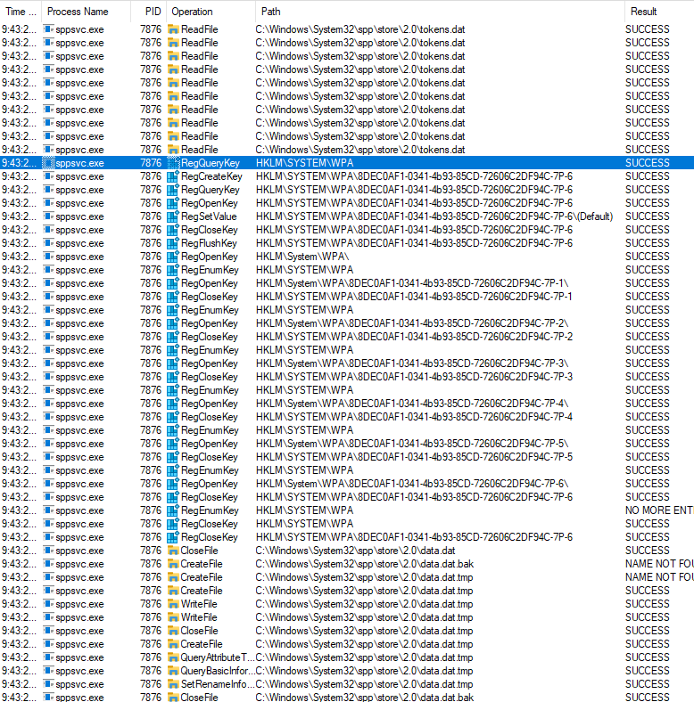

On Windows 8.1 and 10, we observed that data is mainly stored in the following locations:

 - `C:\Windows\System32\spp\store\2.0\data.dat`
 - `C:\Windows\System32\spp\store\2.0\tokens.dat`
 - `HKEY_LOCAL_MACHINE\SYSTEM\WPA`

Windows 8 is almost identical, except that the `.dat` files are stored under `C:\Windows\System32\spp\store`. 

Windows 7, however, is a very different story:

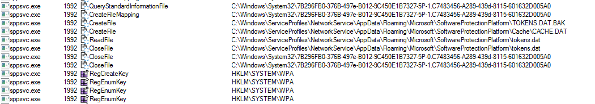

Here, I saw references to the following locations:

 - `C:\Windows\System32\7B296FB0-376B-497e-B012-9C450E1B7327-5P-0.C7483456-A289-439d-8115-601632D005A0`
 - `C:\Windows\System32\7B296FB0-376B-497e-B012-9C450E1B7327-5P-1.C7483456-A289-439d-8115-601632D005A0`
 - `C:\Windows\ServiceProfiles\NetworkService\AppData\Roaming\Microsoft\SoftwareProtectionPlatform\tokens.dat`
 - `HKEY_LOCAL_MACHINE\SYSTEM\WPA`

More strangely, though, I found that sppsvc wouldn't write to either of the "7B296..." files or WPA registry keys directly. Instead, it would use the [`DeviceIoControl`](https://learn.microsoft.com/en-us/windows/win32/api/ioapiset/nf-ioapiset-deviceiocontrol) method to call a driver known as `spsys.sys`. This driver would then handle writing to "7B296..." files and WPA registry keys.

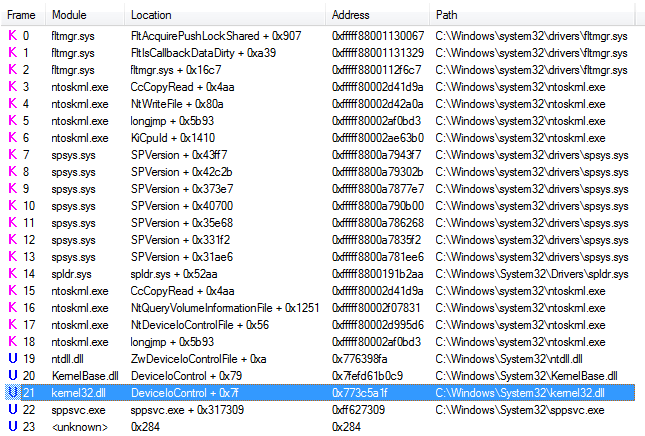

In comparing these files and registry keys, I saw quite a few similarities. The `tokens.dat` files were mostly uninteresting at first, since across all versions, these files seemed to just hold the contents of the XML licenses in a similarly named folder: `C:\Windows\System32\spp\tokens`. 

The "7B296..." and `data.dat` files seemed to serve similar roles, as these files were not only encrypted, but they seemed to have some kind of hash or signature included as well. Corrupting or deleting these files would uninstall all installed product keys and reset all other activation data (rearm counts, KMS client counts, etc.). On Windows 7, it would also show this lovely error message:

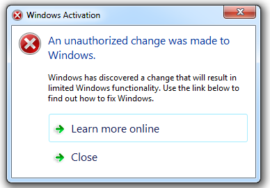

Setting aside the question of how I can't be authorized to make changes to my own computer, after installing a product key, I get a notification for "tampering with the trusted store" across several versions:

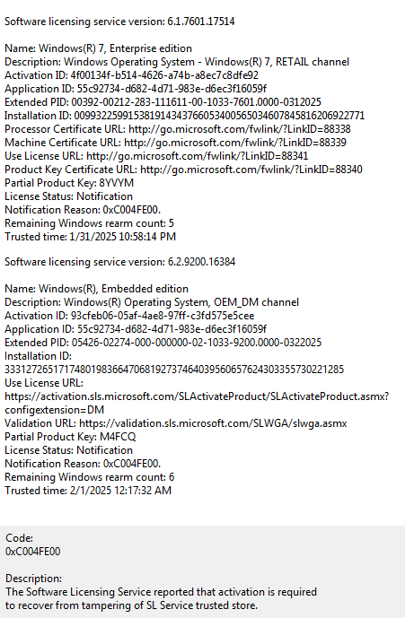

Putting all this together, it would seem like the "7B296..." files and `data.dat` both serve as storage for important activation data, and they seem to be referred to internally as the "trusted store".

A similar process of brute-force tampering with the WPA registry keys showed that they were somehow linked with the trusted store. New keys with seemingly encrypted data were added under `HKEY_LOCAL_MACHINE\SYSTEM\WPA` periodically, as well as after significant licensing changes. Additionally, thanks to the [`NtLockProductActivationKeys`](https://www.tiraniddo.dev/2017/07/locking-your-registry-keys-for-fun-and.html) function, these keys were entirely read-only and unable to be deleted, unless you messed with them from a Windows PE environment. Tampering with or deleting these keys caused similar "license tampering" errors to appear, but if we copied these keys along with trusted store files from one installation to another, sppsvc didn't seem to complain about tampering anymore.

From all of this work, we learned the following things:

 - Critical activation data like product keys and rearm counts are stored in something known as the "trusted store"
 - The trusted store's data is held in encrypted files
 - This data is somehow linked with seemingly encrypted registry keys under `HKLM\SYSTEM\WPA`

Unfortunately, we didn't know much more than this for quite a long time. My work on deobfuscating both [older](https://github.com/UMSKT/peacestone) and [newer](https://github.com/WitherOrNot/warbird-docs) versions of sppsvc helped us in confirming some of our theories, but without an understanding of `spsys.sys`, they didn't contribute much. In the meantime, we built an automated version of the CID trick, using a custom kernel driver to patch sppsvc without adjusting its [protected process](https://www.alex-ionescu.com/why-protected-processes-are-a-bad-idea/) status, which helped greatly with testing CID trick. 

Aside from this, though, we mostly shelved this work in favor of investigating CLiP, which seemed to have more promising avenues for exploitation.

## When It Leaks, It Floods

Although we focus heavily on Windows piracy, many of us MASSGRAVE members are also interested in its development history, or more specifically, its various pre-release beta builds. Studying and messing with these builds is not only fun as a novelty, but the artifacts that get left in during development can help us learn a lot about how Windows works. 

While discussing activation mechanisms of recently leaked Windows 8 builds with some beta conoisseurs, I was casually blindsided with a couple major reveals:

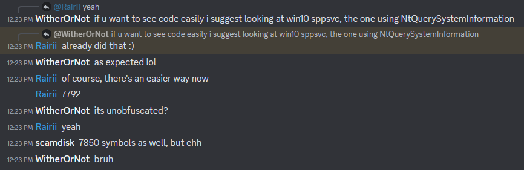

Although [build 7792](https://betawiki.net/wiki/Windows_8_build_7792) and [build 7850](https://betawiki.net/wiki/Windows_8_build_7850) were on the path to Windows 8 development, their build numbers were close enough to Windows 7 (build 7600) that I was hopeful for some new information on spsys. Indeed, within a [symbol archive for build 7850](https://archive.org/details/Win8_7850_x64fre_symbols), I found symbols for spsys, along with the rest of the activation subsystem.

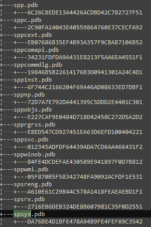

Build 7792 also had a version of spsys that was entirely unobfuscated, just as advertised, but with no symbols. Build 7850's spsys, on the other hand, had full symbols along with full obfuscation. While I wasn't able to have my cake and eat it too, this pairing was still an incredibly lucky finding, so I decided to use it to figure out how the trusted store works.

## Spells and Curses

As usual with lucky breaks, this one came with strings attached. The biggest one was that, unlike with any other normal Windows build, kernel debugging with WinDBG didn't work at all on build 7792, as this was one of the earliest ARM ports of Windows.

So, although I had a completely deobfuscated copy of spsys without any annoying anti-debug features, I had very few options to actually debug it. Since this build was being emulated in QEMU, I still had the option of using its built-in GDB debugging server, but this would be very difficult to use, as I would have to manually locate the kernel and drivers in memory to do anything useful. Luckily, I was able to get in touch with Rairii, who was more familiar with this debugging method thanks to his work on [emulating early Windows on ARM](https://github.com/Wack0/tegra2_qemu_woa).

Unfortunately, I knew little about QEMU OS debugging, or ARM, or very low-level Windows internals, so his advice was a bit difficult to follow at first...

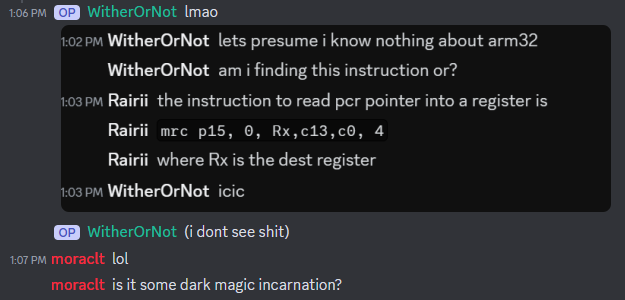

Compounding the problem was my choice to write custom tooling for this project, using a GDB client library to control QEMU and automatically break whenever spsys loaded. Much like most of my attempts at custom tooling, this ended up being a gigantic waste of time that ultimately didn't even work in the end, not least due to my inexperience with GDB in general. After wasting even more time trying to add Windows support to GDB through its [Python API](https://sourceware.org/gdb/current/onlinedocs/gdb.html/Python-API.html#Python-API), I ended up biting the bullet and choosing the devil I knew, the IDA Pro debugger.

Yes, it's the least "appropriate" choice for debugging a kernel or debugging QEMU (or really anything at all), but what was more important to me was that I'm familiar with it. Using the various kernel structs I grabbed and modified from [build 7915](https://betawiki.net/wiki/Windows_8_build_7915)'s symbol set, I was able to crap out a script that would breakpoint on various kernel functions and grab important data, like the kernel base address and list of loaded kernel modules. By programmatically breaking on `IopLoadDriver`, I could even automatically update the module list as each driver was loaded.

However, even with this monitoring system, I still couldn't catch the moment that `spsys.sys` loaded. It was only after checking the code for its loader, `spldr.sys`, that I spotted an interesting call to `ZwSetSystemInformation`:

Referencing [Geoff Chappell's table](https://www.geoffchappell.com/studies/windows/km/ntoskrnl/api/ex/sysinfo/set.htm), I saw that this corresponded to `SystemLoadGdiDriverInSystemSpace`, which, of course, has it's own branch in the kernel code that can load drivers without invoking `IopLoadDriver`.

After breaking at this branch as well, I could finally catch `spsys.sys` as soon as it loaded!

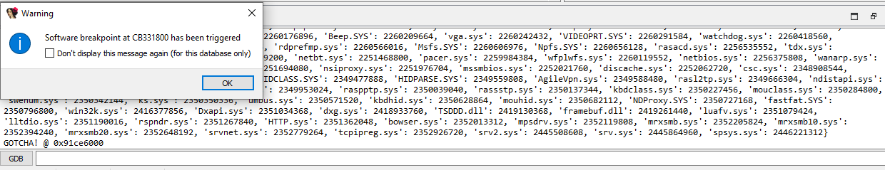

All this work, mind you, ended up implementing what would've been just `sxe ld spsys` if WinDBG worked. Regardless, I was now able to catch and debug build 7792's spsys right as it loaded, without the annoying obfuscation and anti-debug in the way.

Speaking of obfuscation, I still needed to unpack build 7850's spsys to make any sense of it. Fortunately, this was much easier, since I could search for where calls to encrypted functions are made.

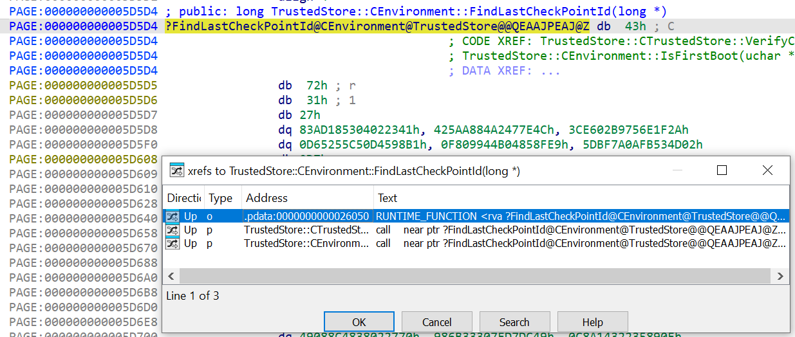

Then, I just had to break at these calls in the kernel debugger and dump the driver from memory, and I got all of the the code decrypted fairly easily. From here, it was just a long process of transferring symbols by eye, and I was finally at square one.

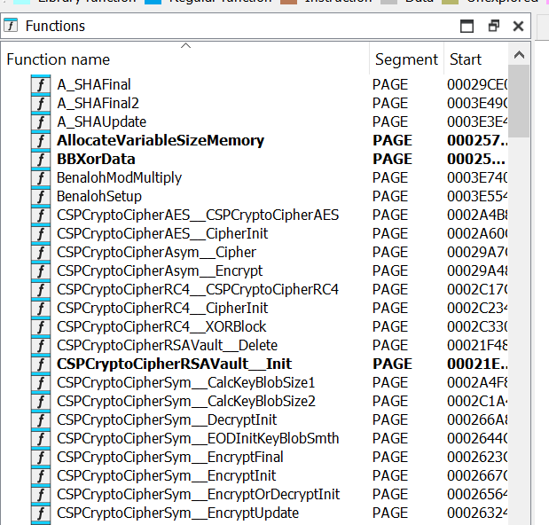

## Progress At Last

With all of the functions labeled, I noticed an interesting pattern in the code that generates the trusted store file, which seems to be called the "physical store". Rather than the typical approach of storing encrypted data in a separate buffer, Microsoft seemed to opt for doing their encryption in-place.

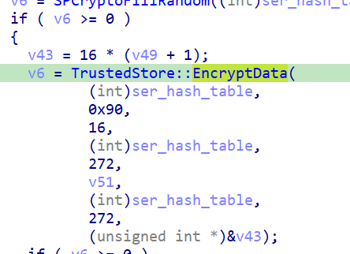

This probably prevents some kind of side-channel attack, but more importantly, it means that I can "decrypt" the physical store by simply skipping this call in the debugger and letting spsys write the un-encrypted contents to the disk. And so I did:

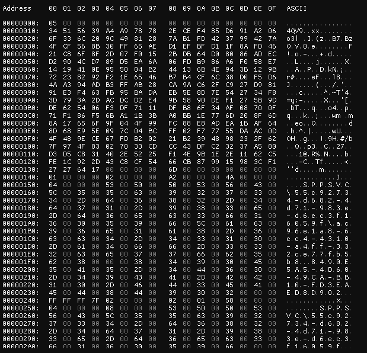

asdcorp and abbodi1406 immediately went to work, figuring out the data format and what kind of data is stored within. Meanwhile, I was focused on replicating this trick on Windows 10, where analysis would be far easier, not least due to having an actual debugger (x64dbg) available. Conveniently, the function HIDHash had some very unique constants in it:

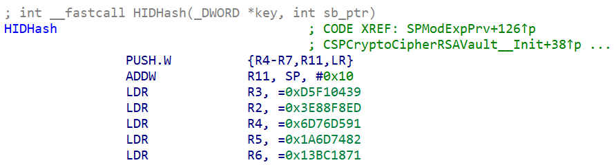

Searching for these constants in Windows 10's sppsvc led me to the same function in sppsvc:

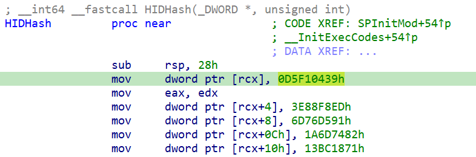

As I found out, most of spsys's code ended up being included in sppsvc on Windows 10. Comparing these codebases, I found all of the encryption, decryption, signature check, and hash check routines. Patching all of these routines out in the debugger, we could get sppsvc to not only decrypt its `data.dat` for us, but also to load and accept any modifications we made in it. 

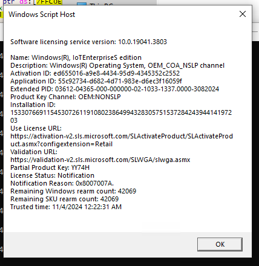

In the process of testing these patches, we ended up finding the long-lost product key for [Redpill](https://betawiki.net/wiki/Feature_lockout_in_Windows#Windows_8), a feature lockout system for beta releases of Windows 8. 

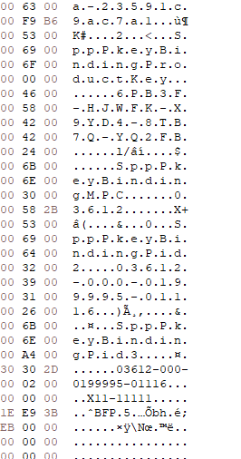

With some experimentation and a bit of assistance from me, asdcorp managed to reproduce the CID trick, but this time without patching the CID verification routine.

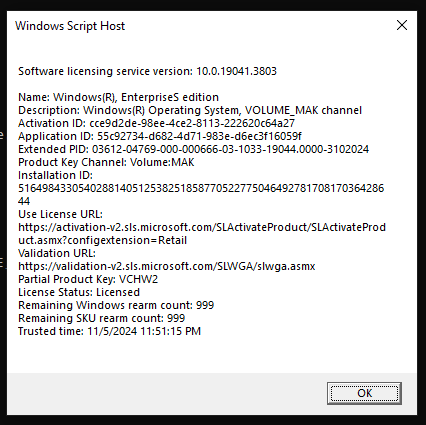

From here, asdcorp and Lyssa figured out and tested even more exploits, including a method to KMS-activate offline for over 4000 years.

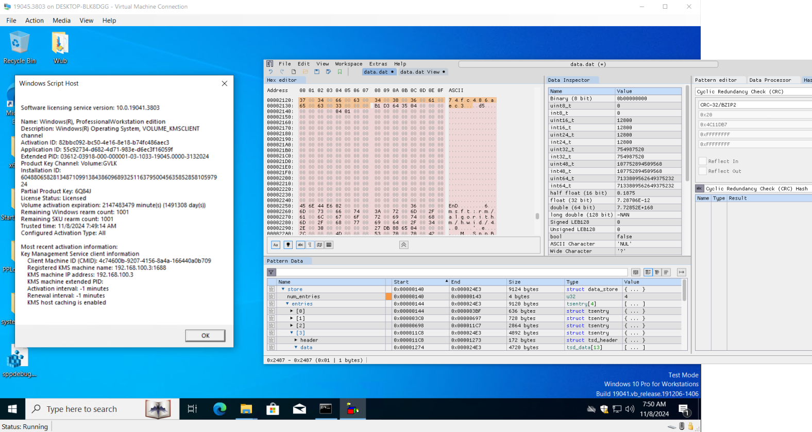

Although these results marked significant progress, we still needed to use a debugger to test these methods, since we had no way to decrypt and re-encrypt the physical store by ourselves. So, my next task was to figure out how to do just that.

## Private Key Derivation

I knew from looking at spsys that the only real key I needed to derive was an RSA key, which encrypts an AES key that encrypts the physical store data. I also knew from tests conducted with asdcorp that there were only two such keys: one for production/official beta versions and one for internal testing/Windows Insider versions. In the absence of raw key data, we found this out with a highly advanced method: copying physical store files, editing its version, and waiting for sppsvc to crash horrifically, signaling that it could decrypt but not parse the swapped file.

Examining the RSA decryption routine, called `SpModExpPrv`, I found a interpreter for a bytecode system known as `ExecCodes`. With a lot of drudgery and regexes, I was able to write a simulator of this system in Python.

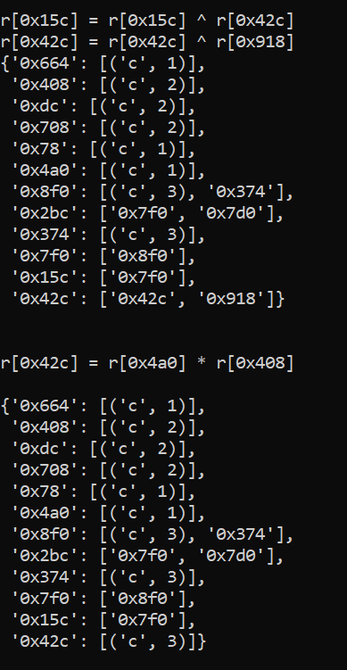

Observing the output of this simulation, I realized that all of this obfuscation covered up a technique I had vaguely heard of before, known as [addition-chain exponentiation](https://en.wikipedia.org/wiki/Addition-chain_exponentiation). With a bit of thinking, I realized that I could just track and dump the inputs and outputs of each modular multiplication and use this to derive the private key. All it took was x64dbg logging and a few more lines of python:

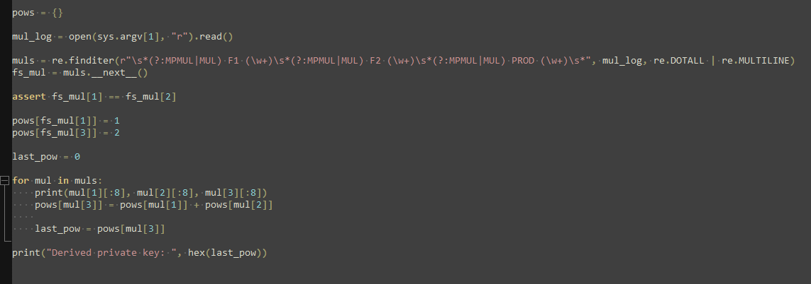

And at last, I had the complete production key for all of SPP, from Windows Vista to Windows 11.

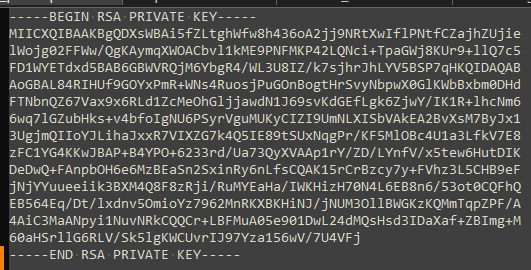

Deriving the test key took a little while longer, due to some weird differences in how the modular multiplications were implemented, but eventually, we had every SPP private key we needed.

## Nailing The Coffin

With the private key in hand, we were able to activate almost any edition we wanted with ease. There was still one bit of trouble, though, and that was in obtaining generic keys to enable activation.

On Windows 8 and up, it's rather [trivial](https://github.com/awuctl/licensing-stuff) to generate generic keys for any channel of any edition you wanted. However, Windows 7 and CSVLKs (KMS host keys) up to Server 2022 used [PKEY2005](https://github.com/UMSKT/writeups/blob/main/PKEY2005.md), a much more complicated encoding system that needed private keys to generate even generic keys. Since I didn't have any cryptographic tricks left up my sleeve, we decided the best way through this problem was around.

Within the physical store are large blobs for each product key, containing various pre-computed information, such as the product IDs and phone activation data. Additionally, we found that the token store (`tokens.dat`) also contains metadata tying product keys to the current edition of Windows. Therefore, we figured that simply replicating this data was enough to trick Windows into thinking a key was installed, and for once, we were right.

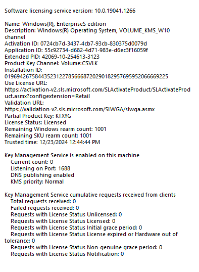

In the meantime, while developing a programmatic method for the new CID trick, which we now called ZeroCID, we were having trouble with the HWID data we needed to write into the physical store. Originally, we tried using a [C# port of GatherOsState's HWID derivation](https://github.com/laomms/HwidGenerator), but this ended up failing to validate in some rare cases. Since we had few options to debug or fix this port, asdcorp decided to create an HWID value that would apply to all hardware, and yet again, it worked perfectly, even allowing transfer of activation between machines.

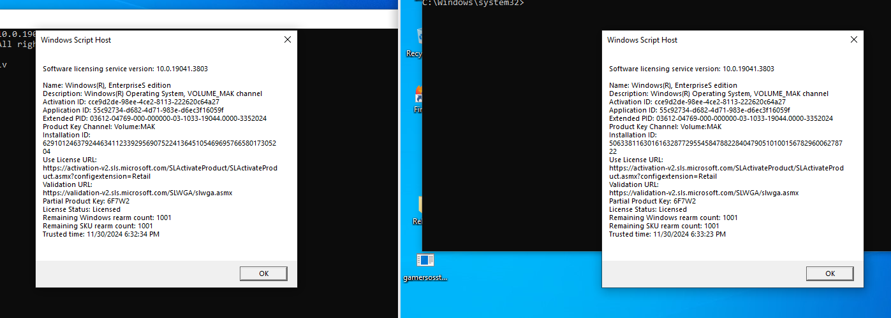

With the HWID validation and PKEY2005 defeated, we had now almost entirely defeated SPP's offline protections.

## Closing Thoughts

Even with the amount of damage we were able to do to SPP with a debugger and a hex editor, I still think it's a rather advanced and well-built DRM system. Its internals certainly improve upon those of Windows XP's DRM, which, despite whatever some might tell you, was rather poorly designed. It also manages to defend itself fairly well against the most common attacks, such as resetting evaluation timers by swapping physical store files. Additionally, there are still parts of SPP that we haven't managed to crack, like the signed XML licenses used to define its behavior. After all, it's not like there's another [trivial patch](https://github.com/massgravel/MIIEow) that can bypass their signature checks...

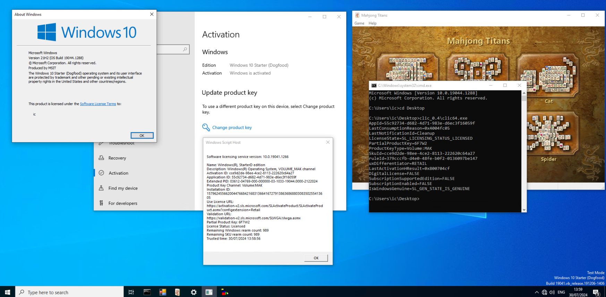

## Credits

#### Core Research and Development

- WitherOrNot - Lead tool development, reverse engineering, testing
- asdcorp - Initial demonstrations, reverse engineering, tool development, testing
- abbodi1406 - Reverse engineering, development, testing
- Lyssa - Reverse engineering, tool development, testing

#### Other Contributions

- May - Code formatting, build setup

#### Special Thanks

- BetaWiki - Documenting leaked beta builds used for reverse engineering
- Rairii - Assistance with initial reverse engineering efforts
- Microsoft - A fun challenge
