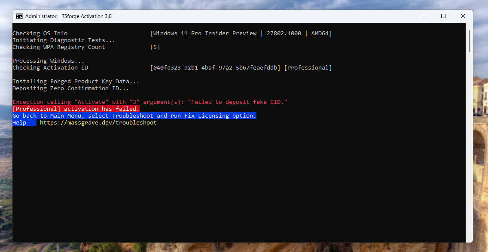
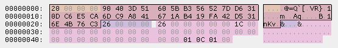
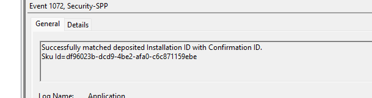
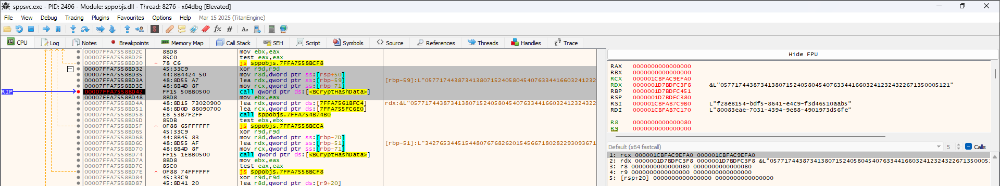
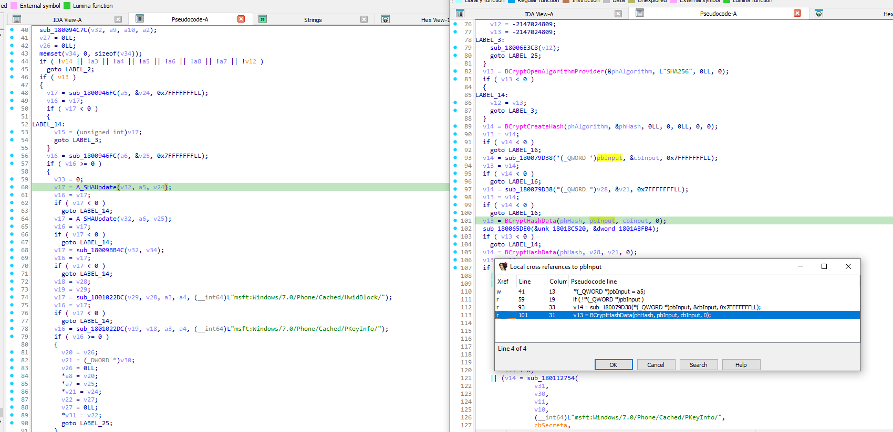
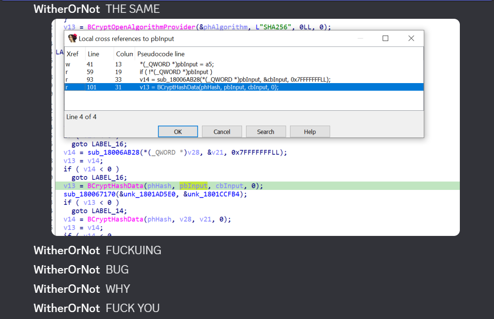
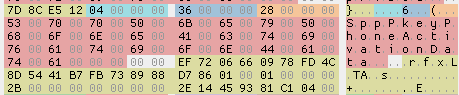

## Introduction

A recent Windows update killed our new activation exploit, [TSforge](https://massgrave.dev/tsforge)... or so we thought. I will break down what went wrong, how we worked around the problem, and in the process, make a point about the apparent decline in Microsoft's code quality control.

<!-- truncate -->

When we released [TSforge](https://massgrave.dev/tsforge) back in February, it served as an entrypoint for [multiple activation methods](https://massgrave.dev/tsforge#zerocid--kms4k--avma4k). Many [news](https://www.techspot.com/news/106819-hacker-group-releases-updated-tool-activate-almost-all.html) [websites](https://www.androidauthority.com/mas-activate-windows-office-v3-tsforge-3527610/) wrote articles about it on release, giving it a ton of publicity.

One of the main goals of TSforge was to enable the free activation of the Windows 10 [Extended Security Updates program](https://learn.microsoft.com/en-us/windows/whats-new/extended-security-updates), giving thousands a simple way to keep using their Windows 10 system safely for a few more years without additional fees. 

It was also the first permanent activation method for Windows versions earlier than Windows 10 that didn't require [installing a bootkit into your system to inject an SLIC table into ACPI](https://forums.mydigitallife.net/threads/windows-loader-download.58464/), a process known to sometimes cause issues with booting the system.

Initially, [MAS](https://massgrave.dev) integrated only one TSforge-based activation method: ZeroCID. ZeroCID was chosen because, due to how it works, it could activate [**basically everything permanently**](https://massgrave.dev/tsforge#supported-products) and it was tested by us rigorously before release to ensure reliability.

Everything was seemingly going fine with the release... until it wasn't.

:::info

This post focuses on the bug and the Software Protection Platform (SPP) DRM system in general as it appears in Windows 11. Specific details may differ in other Windows versions.

:::

## The Incident

Merely a month later, ZeroCID was confirmed patched on the then-latest Windows 11 Insider build, 27802:



To put this into perspective, Microsoft going out of its way to patch (or even care about) activation exploits was [unheard of](https://www.bleepingcomputer.com/news/security/microsoft-support-cracks-windows-for-customer-after-activation-fails/) since the release of Windows 10 back in 2015.

Whenever Microsoft "patched" an activation method, it was almost always an unintentional side effect of an unrelated change. The first version of HWID (our most used activation method to date), for example, was patched by Microsoft unintentionally due to them [finally remembering to cut off the free Windows 7 to Windows 10 upgrade that was supposed to end 7 years prior](https://devicepartner.microsoft.com/en-us/communications/comm-windows-ends-installation-path-for-free-windows-7-8-upgrade). The first version of HWID just so happened to rely on this free upgrade path to grant activation. Fortunately we managed to promptly update it 2 days later to un-patch it. Thanks Bill Gates.

But this time, we weren't so sure. Our immediate conclusion to this was simple: the party was finally over. Microsoft had caught on and patched the exploit intentionally for once. This theory seemed even more likely because the news articles written about TSforge had put us directly in the spotlight, directly in Microsoft's line of sight. It would make sense if Microsoft finally got someone to do something about the new developments in the Windows piracy department, as an attempt to protect their reputation.

But that theory quickly fell apart.

As explained previously, TSforge is simply an entrypoint. We made multiple activation methods that used said entrypoint to function. ZeroCID was now broken, but there also existed KMS4k, which KMS activates Windows for a staggering ~4000 years. We proceeded to test KMS4k on the new, problematic build and it ended up working flawlessly. 

This didn't make a lot of sense. Why would Microsoft make such an incomplete, effectively duct taped attempt to patch an exploit of this magnitude? This was nowhere near a comprehensive fix; it was a targeted hit on only one of the activation methods made possible by TSforge. It didn't feel like a deliberate patch; it felt like an accident. We had to know what really happened.

## Context

:::tip What is ZeroCID?
ZeroCID is an activation method that abuses the caching mechanism of Microsoft's legitimate "phone activation" system. 

It works by creating fake cache entries that trick the Software Protection Platform (SPP) into granting activation without performing the actual cryptographic validation of the Confirmation ID (CID).
:::

The legitimate phone activation process, which ZeroCID exploits, works like this: 

Windows provides you with an "Installation ID" (IID), which you're expected to provide to Microsoft by calling them. They give you back a "Confirmation ID" (CID) which you can use to activate Windows. The CID is cryptographically checked by Windows against a public key stored in the license file of the license you're trying to activate.

Under the hood, SPP stores "cache" entries containing a hash of the IID and CID pair in the "trusted store" (an AES encrypted file containing activation data) upon an attempt to phone activate. This is done to save CPU cycles in the future by avoiding repeated cryptographic checks. Instead, SPP refers to the cache every time it needs to quickly determine whether activation should be granted or not. 

This performance optimization is what ZeroCID abuses to activate Windows since, if there's valid cache entries in the trusted store, SPP will no longer try to validate the input CID and will blindly trust the cache, assuming that everything is, indeed, valid. When you use ZeroCID, it manually adds its own cache entries into the trusted store (where it calculates the hash as if the CID were all 0s, hence the name).

Here's one of the cache entries opened in a hex editor, with the relevant section of the entry selected: 



The first 4 bytes store the length of the hash, and the rest of the highlighted bytes are the hash itself. The hash is created by concatenating the IID and the CID, then SHA256 hashing the final string.

This known, predictable behavior was our baseline when developing the activation methods that used TSforge. Now, it was time to see what was changed.

## Investigation

On the next day, [WitherOrNot](https://github.com/WitherOrNot) began looking into what happened, mostly by trying to figure out what code was changed in SPP in 27802 compared to the previous build. Around the same time, [asdcorp](https://github.com/asdcorp) also started looking into the incident and began inspecting the trusted store on the new build, trying to see if data was being stored differently.

:::tip What is the trusted store?
The trusted store is a file created by SPP using a proprietary format. It's designed to securely store important activation-related data and prevent users from modifying the information inside of it. However, TSforge makes it possible to easily modify the trusted store according to our needs.
:::

Eventually, it was noticed that the IID + CID pair hashes in the cache entries seemed to be calculated differently. At the time, we didn't know what exactly was being hashed, or if a workaround was even possible.

But then, yet another oddity was noticed. After some more time, we noticed that the hashes saved in the cache entries seemed to **change every single time the user checked the activation status**. SPP seemed to now be spamming Event Viewer logs with the following message as well:



This was very unusual, because the above Event Viewer log is only supposed to be sent if the IID and CID pair were re-validated cryptographically. This observation implied that they were essentially feeding garbage to the part of the code that generates the hash, which means that SPP would be **forced** to regenerate the hashes every single time the user performs an operation, therefore, succesfully hackpatching ZeroCID, which depended on SPP not checking the input CID if the cache was present. The cache would now always fail to validate due to the hashes never matching the IID + CID pair provided to SPP by the user.

This was deeply puzzling. It would be an extremely strange way to patch the exploit, to the point that it came across as a bit of an absurd conclusion based on the limited data we had. WitherOrNot doubted this theory and decided to confirm it himself by firing up a debugger (x64dbg), then starting to look for the function which was creating the hash. Surely we were mistaken and something else was going on. 



Here's the debugger, with a breakpoint set on the ``BcryptHashData`` function which has been hit. You can see the arguments it's receiving on the right hand side. Even from this one screenshot, the issue is pretty clearly visible. For those unfamiliar with C-like languages, the ampersand (&) you see here before the second argument means we're passing a memory address *to* the data, not the data itself.

Yep, they're **hashing the memory address of the data instead of the data itself**. Which means the calculated hash will *always* be different every time SPP runs this check. This is effectively **RNG-based hashing.** They actually make this mistake twice, on both the IID and the CID.

To illustrate this more clearly, here's a simplified pseudocode representation of how you're supposed to do this correctly with BCrypt:

```c title="Correct implementation of the changes"
// Get the IID and the CID
LPWSTR iid_data = get_iid();
LPWSTR cid_data = get_cid();

// Create a handle for the SHA256 algorithm
hash_handle = BCryptCreateHash(...);

// 1. Hash the IID
BCryptHashData(hash_handle, iid_data, size_of_iid, 0);

// 2. Hash the CID
BCryptHashData(hash_handle, cid_data, size_of_cid, 0);

// 3. Get the resulting hash
BCryptFinishHash(hash_handle, final_hash_buffer, ...);
```

This is what Windows 11 does instead:

```c
// Get the IID and the CID
LPWSTR iid_data = get_iid();
LPWSTR cid_data = get_cid();

// Create a handle for the SHA256 algorithm
hash_handle = BCryptCreateHash(...);

// 1. Hash the **address** of the IID data buffer
BCryptHashData(hash_handle, &iid_data, size_of_iid, 0);

// 2. Hash the **address** of the CID data buffer
BCryptHashData(hash_handle, &cid_data, size_of_cid, 0);

// The resulting hash is now useless due to the memory locations always being different
BCryptFinishHash(hash_handle, final_hash_buffer, ...);
```

Even if they made this mistake once, it still would have singlehandedly killed the phone activation cache, and by extension, ZeroCID. The cache would be generated with a completely random hash, and on the next check, it would fail validation because the memory locations of these inputs are very volatile and bound to change each time.

As mentioned previously, ZeroCID depends on SPP reading the cache, validating it successfully, then skipping cryptographic validation. If you legitimately phone activate Windows, you would be mostly unaffected by this bug. This is because, even though the cache would always fail to pass the hash checks, since the input IID and CID are actually valid, SPP can simply perform the cryptographic revalidations necessary every single time without issue.

Of course, this is inefficient. But, as we know from Windows 11, Microsoft doesn't care much about optimizing their OS anymore. If it isn't a massive problem, it's not important enough to be fixed.

Before the release of our workaround method (dubbed StaticCID), we attempted to report this bug to Microsoft and bring it to their attention using the Feedback Hub, where your filed issue will have a very slim chance to be seen by anyone who can fix the bug until your post gets a large amount of upvotes. We sought other possible avenues to get *someone* to remove the damn &'s from the code, with no luck.

## Really?

Now, you might ask a reasonable question: "Why?". To be perfectly candid, I am not really sure.

Compared to the Windows 10 version of sppobjs.dll (the SPP "plugin" that performs this crypto check and writes the cache), it seems like the changes made to the now-problematic function was part of an effort, possibly by a single engineer, to transition this part of the code from using SPP's internal hashing implementations to using the external, Microsoft-made library called [Bcrypt](https://learn.microsoft.com/en-us/windows/win32/api/bcrypt/) instead:



It's not clear why this "refactoring" was done, considering that this code had otherwise been untouched for more than a decade. Maybe the goal was to "optimize" this hash check in some way? In the era of modern CPUs, this makes little sense. To simplify the code? Maybe. But, as I said, this code had been untouched for **a decade**. This seems like changing things just for the sake of changing things. 

A change like this *should* have been carefully reviewed. Clearly, it wasn't.

The Windows Git repository has thousands of branches, and changes get reverse-integrated into different branches, slowly making their way down to whatever is the release branch. This bug got past the initial code review, made its way from the Windows Insider Canary channel, to the Dev channel, to the beta channel (already making the change very likely to reach stable builds), then it was finally shipped with the June cumulative updates. 

This bug slipped past *at least* 4 branches, completely unacknowledged, leaving us hopeless that Microsoft would do anything to fix this slip up.

And yes, we kept checking if Microsoft used their chance to notice the bug or not after every major build.



## Turning the Tables

Many of you may have read our [TSforge blog](https://massgrave.dev/blog/tsforge) from a few months ago, where we explained the process of creating the exploit. What wasn't described there was how we became aware of yet another method during development (approximately November 2024), which ultimately didn't end up being shipped with the final product due to fears of potential instability. After we became aware of the patch, we quickly went back to take another look at this method and start testing it further.

The method is quite interesting. Effectively, it mimics real phone activation as closely as possible while still managing to activate Windows for free. How, exactly? Let's explain.

We can start by taking a look at the ``SppPkeyPhoneActivationData`` block in the trusted store for the currently installed license to see what it consists of:



The information located in this block is what SPP uses during phone activation, and it's always written when a product key is being installed. This block contains information about said product key, namely:
- The group ID.
- The serial number.
- The "security" value.

What these values represent isn't important, what *is* important is that, in theory, this is all the information we need to successfully phone activate Windows! We can simply rip these values out of a genuine, working key and manually insert this information into the trusted store. 

After doing the above, SPP will generate an IID based on data ripped from a genuine product key, rather than data from the generic product key that Windows comes with by default. This means that Microsoft will allow us to use our newly obtained, activatable IID to get a CID, allowing us to phone activate Windows for free. 

At first glance, the non-trivial part of this is getting the CID autonomously. Obviously, it is far from ideal to force our users to call Microsoft on the phone and provide them with the IID manually, so we needed a better way.

Luckily, a Microsoft tool already exists called the [Volume Activation Management Tool](https://learn.microsoft.com/en-us/windows/deployment/volume-activation/introduction-vamt) (VAMT), which has functionality for ["proxy activating"](https://learn.microsoft.com/en-us/windows/deployment/volume-activation/proxy-activation-vamt) Windows systems.

Proxy activation essentially performs the equivalent of phone activation in a way which allows for activating many client computers isolated from the outer internet, while avoiding having to call any phone numbers. A master "VAMT Host" computer, which does have internet access, acquires the CID online from an online endpoint and applies it to the client computers to activate them.

Some people have reverse-engineered how VAMT does this, and there's a really nice tool called [ActivationWs](https://github.com/dadorner-msft/activationws) which uses the same endpoints that VAMT uses to acquire the CID. StaticCID uses this tool to get the CID, then it deposits the CID, successfully pulling off a weird, but effective mix of phone and online activation.

## Quality is Job None

The new StaticCID method is now introduced into [MAS](https://massgrave.dev) and is working flawlessly. Previously, MAS only offered ZeroCID, with no option to use anything else. This was initially done due to ZeroCID being powerful enough to overshadow everything else made possible by the discovery of TSforge. Now, we are being more cautious due to Microsoft seemingly messing up even the oldest parts of the codebase without reason and have made 3 methods accessible instead of only one: StaticCID, ZeroCID and the previously-mentioned KMS4k. 

The script automatically chooses which method is best for the current OS, while also allowing the user to manually specify which one they prefer. The script automatically chooses StaticCID as the default option on Windows 10 as well, due to concerns about the bug being backported to older Windows versions. We've observed Microsoft do this a few times before, even though [Windows 10 isn't supposed to get new feature updates anymore](https://techcommunity.microsoft.com/blog/windows-itpro-blog/windows-client-roadmap-update-april-2023/3805227), so it feels like a worthwhile precaution.

This incident suggests a troubling trend in Microsoft's development and code quality assurance pipeline. Only time will tell what else they'll inadvertently break and fail to fix. However, we will continue to adapt to these changes and deliver the best experience possible to our users, regardless of what Microsoft does next.