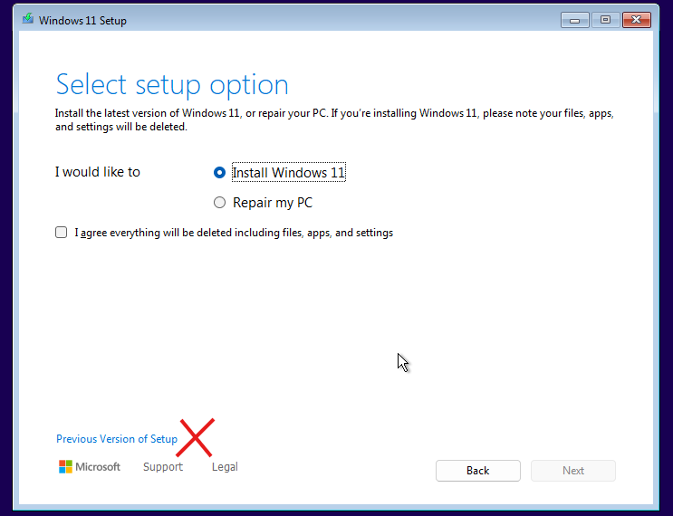
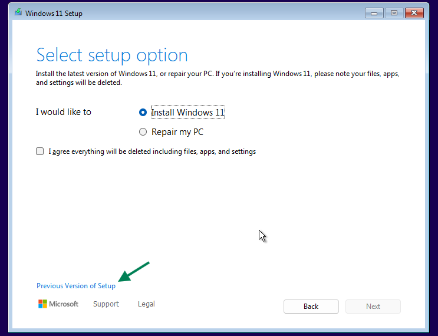

# Clean Install Windows

Guide on how to backup your data and clean install Windows.

---

## Prerequisites

- A genuine Windows ISO file. You can get one from [here](genuine-installation-media.md).
- The latest version of Rufus from https://rufus.ie/
- A minimum 8GB USB drive  
- Follow this [guide](remove_malware.md) before making a bootable USB if you think the system has malware.
<details>
  <summary>Another clean system if your current system is infected with File infector malware.</summary>

  **Why?**  
  Because file infector malware can copy itself to the bootable USB that you are going to make to perform a clean installation.  
  You need to use another clean system to make a bootable USB and plug it into the current infected system only when it's not running live Windows.  
  **How to check if you have file infector malware?**  
  Open PowerShell as administrator and enter  
  `sc.exe start "sppsvc" > $null 2>&1; Write-Host "Error code: $LASTEXITCODE"`  
  If the output is 577 or 225, then most likely chances are that the system is infected with File infector malware. 
  
  **What if you don't have another clean system?**  
  You can try Dr.Web https://free.drweb.com/download+cureit/gr to remove file infector malware. However in some cases, it may miss to remove all, that's why its best to make bootable USB on another clean system.


</details>

---

## Back up your data

The clean installation process will format the C drive where Windows is installed; if you have any data in the C drive, you need to back it up.

import Tabs from '@theme/Tabs';
import TabItem from '@theme/TabItem';

<Tabs>
<TabItem value="multiple_partition" label="I have multiple partitions on my drive, like C:\ D:\" default>

- You can copy your data from C drive and paste it into other partitions.
- Your data is usually located in the below place on the C drive,  
  - Go to this folder `C:\Users` and then select the user account that you are using.
  - Your data is saved in Desktop, Documents, Downloads, Music, Pictures, and Videos folders.
  - Save these folders in another partition to backup.

</TabItem>

<TabItem value="one_partition" label="I have C:\ drive only" default>

- Your data is usually located in the below place on the C drive,  
  - Go to this folder `C:\Users` and then select the user account that you are using.
  - Your data is saved in Desktop, Documents, Downloads, Music, Pictures, and Videos folders.
- If you have a **small amount of data** to back up, save it on the below listed online drives or the USB drive after making it bootable with Rufus.
- If you have a **large amount of data** that you can't save on an external drive or online drive,  
  - Create another partition using this guide https://youtu.be/_HgjasKuOBw
  - Save your data onto that other newly created partition.

</TabItem>
</Tabs>

---

:::tip

It's highly recommended to backup your critical data on some online drive as well, for example,  
[GoogleDrive](https://drive.google.com/) - 15GB Free  
[OneDrive](https://onedrive.live.com/) - 5GB Free  
[Mega](https://mega.io/) - 20GB Free  

:::

---

## Create a bootable USB with Rufus

- Plug your USB drive into the system. (Its data will be deleted.)
- Launch Rufus which you downloaded earlier.
- In the "Device" dropdown, select your USB flash drive.
- Boot Selection:
  - Click "SELECT" and choose your Windows ISO file. Rufus will auto-configure optimal settings.
- Click "START."
- Wait for Rufus to create the bootable USB. It may take several minutes. You'll see "READY" when done.

---

## Windows 11 on Unsupported Hardware

<details>
  <summary>Click here to view</summary>

- Rufus can help you install Windows 11 on unsupported hardware, but you will encounter problems with future feature updates since Microsoft does not permit that on such hardware.
- To resolve this issue, you need to install IoT Enterprise 24H2 (2024) (or newer) edition which is [officially supported](https://learn.microsoft.com/en-us/windows/iot/iot-enterprise/Hardware/System_Requirements?tabs=Windows11LTSC#optional-minimum-requirements) on unsupported hardware. Don't worry about it being an unusual edition; it's binary identical to other editions, with the primary difference being the licensing.
- This IoT Enterprise edition comes in 2 flavors,
  - IoT Enterprise (GAC, General Availability Channel) 
  - IoT Enterprise (LTSC, Long-Term Servicing Channel)
- Next question, how do we install this edition?  
  - for GAC version, you don't need IoT Enterprise ISO, you can simply use regular Windows 11 25H2 consumer (linked at the top) or business ISO.
  - for LTSC version, you need to download the full version of LTSC ISO (don't use eval), it doesn't have to be IoT ISO, you can download a normal LTSC ISO in your language.
  - After flashing the required ISO using Rufus, navigate to the `\sources\` folder on the USB drive and create a file named `PID.txt` (ensure the file extension is correct). Open this file with Notepad and enter the text below.
    - for GAC version  
	  ```
	  [PID]
	  Value=XQQYW-NFFMW-XJPBH-K8732-CKFFD
	  ```
    - for LTSC version  
	  ```
	  [PID]
	  Value=CGK42-GYN6Y-VD22B-BX98W-J8JXD
	  ```
- When installing Windows, avoid selecting the "Previous version of the setup" option. The PID.txt method for virtual editions only works with the new installer in Windows 11 24H2 (or newer).



- That's it. The setup will auto-pick the IoT Enterprise edition.

Alternatively, if you don't want to do that, you can install Windows normally and later change the edition to IoT Enterprise.


:::info

**Note for IoT Enterprise (GAC) - Not LTSC**  

When installing Windows IoT Enterprise (GAC):

- If your system has an **OEM license** in the motherboard (Pro or higher),
- And the key used in Setup is **OEM**,

then Windows Setup will apply the OEM key from the motherboard during the final stage.

**What this means**  
- You can install **IoT Enterprise** with its features (including relaxed hardware requirements on Windows 11 24H2 (or newer), etc.).
- After installation, the system will show Pro edition, not IoT Enterprise.
- This happens because IoT Enterprise (GAC) is distributed only with an OEM key.
- This behavior is normal and cannot be avoided.

**Fix**  
After installation, switch the edition by running the following in command prompt as administrator.

```
slmgr.vbs /ipk XQQYW-NFFMW-XJPBH-K8732-CKFFD
```

:::


:::tip

If you plan to use an ISO file to install Windows instead of a USB drive and want to edit the ISO file, follow these steps.

-   Download [AnyBurn Free Portable](https://www.anyburn.com/download.php) and extract the zip file.
-   Run the file named `AnyBurn(64-bit)\AnyBurn.exe`.
-   Select the option named `Edit image file`.
-   Follow the on-screen instructions and add the file in `sources` folder as described above.
-   Save the ISO, that's it.

:::


</details>

---

## Edition List During Windows Installation

<details>
  <summary>Click here to view</summary>
  
- If your system has an OEM license installed by the manufacturer on the motherboard, then the Windows setup will not show the edition list and will automatically select the edition based on the license on the motherboard.
- If you have such hardware and want to view the list of available editions for Windows installation, follow the steps below.
- After flashing the required ISO using Rufus, navigate to the `\sources\` folder on the USB drive and create a file named `ei.cfg` (ensure the file extension is correct). Open this file with Notepad and enter the text below.
```
[Channel]
NoKeyChannel
```
- Now you can view the edition list and pick the edition you want from Windows Vista to Windows 11. It also helps you avoid installing key in Windows 8/8.1 setup where key installation can not be skipped.

:::note
  
- In Windows 11 24H2 (or newer), the new installer does not support this, so you need to select the "Previous version of the setup" option when the setup starts.



- If you are using PID.txt, please note that it will take precedence over ei.cfg.

:::


:::tip

If you plan to use an ISO file to install Windows instead of a USB drive and want to edit the ISO file, follow these steps.

-   Download [AnyBurn Free Portable](https://www.anyburn.com/download.php) and extract the zip file.
-   Run the file named `AnyBurn(64-bit)\AnyBurn.exe`.
-   Select the option named `Edit image file`.
-   Follow the on-screen instructions and add the file in `sources` folder as described above.
-   Save the ISO, that's it.

:::


</details>

---

## Clean Install Windows

- Disconnect all external or non-boot internal drives to reduce installation risks.
- Restart your PC and boot from the USB flash drive, typically accessed by pressing F11 or F12 during startup. If it's not working for you then Google the type of device you have followed by "boot menu key", for example, "Asus Zephyrus G14 boot menu key" and find the results for your model number.
- Follow on-screen instructions.
  - Choose "Custom: Install Windows only (advanced)" for a clean install.
  - Delete all partitions on the boot drive, or if you want to save data partitions then delete only the C drive and other small system partitions, and select the unallocated space created.
  - Click "Next" to start the installation. Windows will auto-create the necessary partitions.

---

## Bypass Windows 11 Internet and Microsoft Account Requirements

Rufus offers an option to bypass the Internet and Microsoft Account requirements for installing Windows 11. However, if you prefer a different method, follow these steps:

1. When you see the "Let's connect you to a network" screen, 
2. Press Shift + F10 to open a command prompt.
3. Type `start ms-cxh:localonly` and press Enter.

This allows you to continue the installation without needing to connect to the Internet or use a Microsoft account.

**Note:**  
This method no longer works on the latest Insider builds. You’ll need to use [WinJS-Microsoft-Account-Bypass](https://github.com/the-P1neapple/WinJS-Microsoft-Account-Bypass) or Rufus.

import ReactPlayer from 'react-player'

<ReactPlayer controls width='75%' height='auto' src='/bypass_windows_11_internet_and_microsoft_account_requirement.mp4' />

---

:::tip

-   You can [connect with us](troubleshoot.md) for help if you need.

:::
