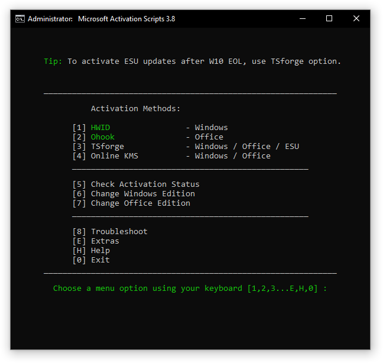
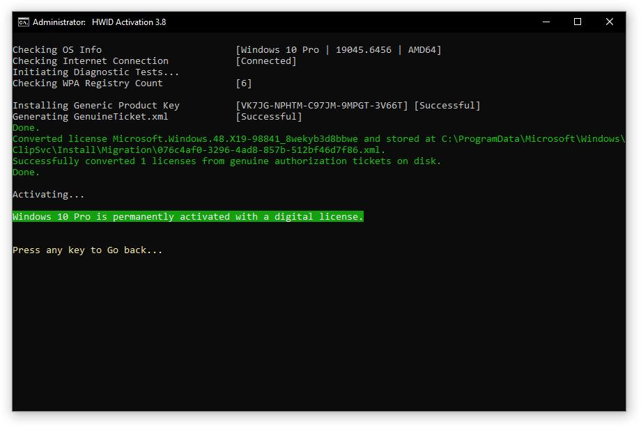
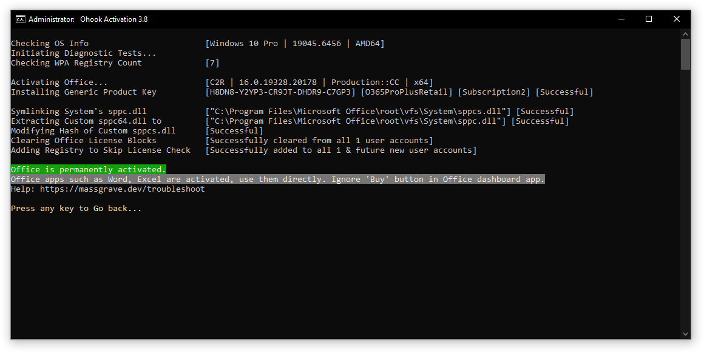
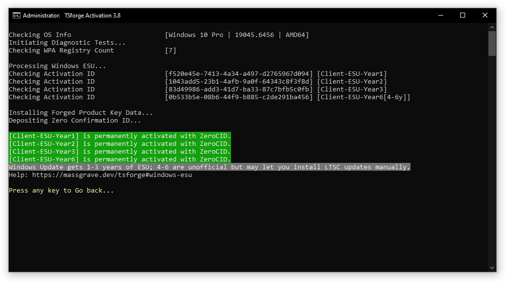
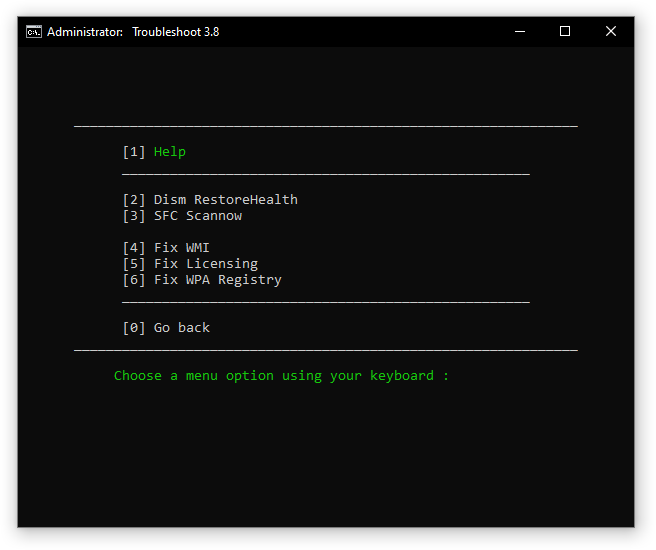
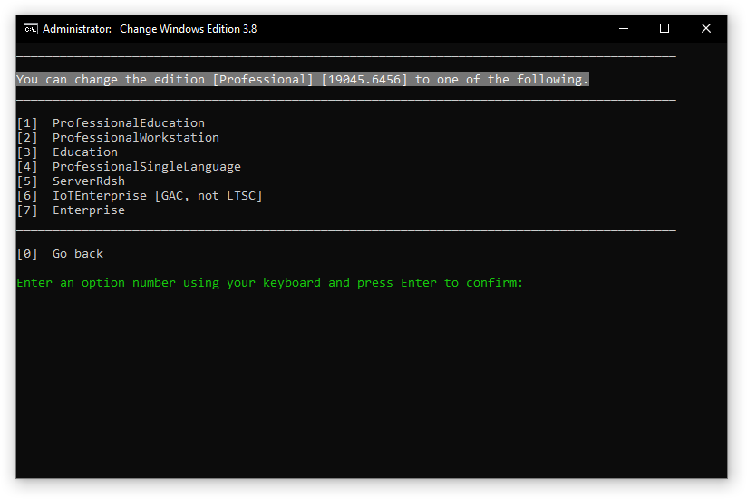
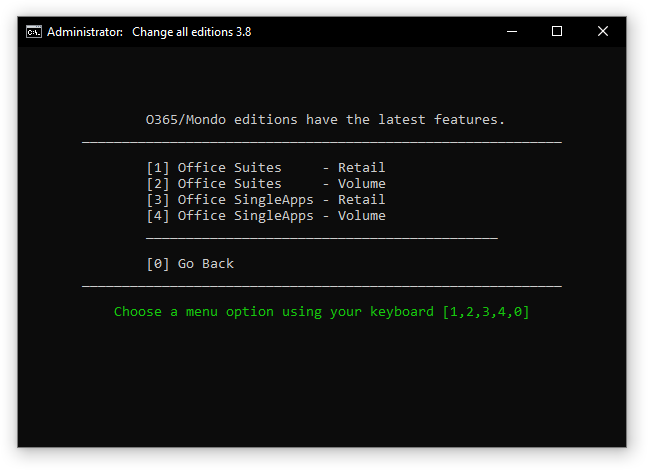
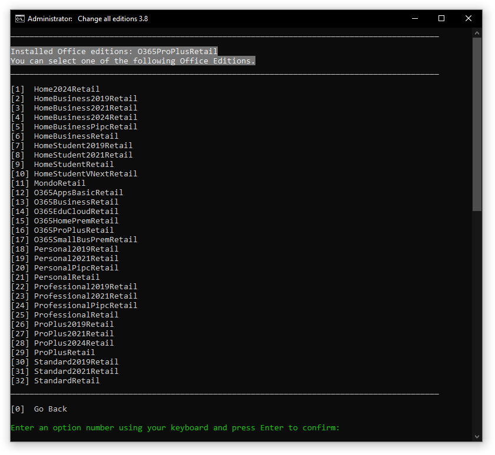

# Microsoft Activation Scripts (MAS)

Open-source Windows and Office activator featuring HWID, Ohook, TSforge, and Online KMS activation methods, along with advanced troubleshooting.

---

### How to Activate Windows / Office / Extended Updates (ESU)?

#### Method 1 - PowerShell ❤️

:::info

1. **Open PowerShell**  
   Click the **Start Menu**, type `PowerShell`, then open it.

2. **Copy and paste the code below, then press enter.**  
   - For **Windows 8, 10, 11**: 📌
     ```
     irm https://get.activated.win | iex
     ```
	 If the above is blocked (by ISP/DNS), try this (needs updated Windows 10 or 11):  
	 ```
	 iex (curl.exe -s --doh-url https://1.1.1.1/dns-query https://get.activated.win | Out-String)
	 ```
   - For **Windows 7** and later:
     ```
     iex ((New-Object Net.WebClient).DownloadString('https://get.activated.win'))
     ```
	- **Script not launching❓Use [**Method 2**](intro.md#method-2---traditional-windows-vista-and-later).**

3. The activation menu will appear. **Choose the green-highlighted options** to activate Windows or Office.

4. **Done!**

:::

#### Method 2 - Traditional (Windows Vista and later)

:::info

1.   Download the script: [**MAS_AIO.cmd**](https://dev.azure.com/massgrave/Microsoft-Activation-Scripts/_apis/git/repositories/Microsoft-Activation-Scripts/items?path=/MAS/All-In-One-Version-KL/MAS_AIO.cmd&download=true) or the [full ZIP](https://dev.azure.com/massgrave/Microsoft-Activation-Scripts/_apis/git/repositories/Microsoft-Activation-Scripts/items?$format=zip).
2.   Run the file named `MAS_AIO.cmd`.
3.   You will see the activation options. Follow the on-screen instructions.
4.   That's all.

:::

---

:::tip

- Some ISPs/DNS block access to our domains. You can bypass this by enabling [DNS-over-HTTPS (DoH)](https://developers.cloudflare.com/1.1.1.1/encryption/dns-over-https/encrypted-dns-browsers/) in your browser.  
- **Having trouble**❓Connect with us [here](troubleshoot.md).

:::

---

- To activate additional products such as **Office for macOS, Visual Studio, RDS CALs, and Windows XP**, check [here](unsupported_products_activation.md).
- To run the scripts in unattended mode, check [here](command_line_switches.md).

---

:::note

- The IRM command in PowerShell downloads a script from a specified URL, and the IEX command executes it.
- Always double-check the URL before executing the command and verify the source is trustworthy when manually downloading files.
- Be cautious, as some spread malware disguised as MAS by changing the URL in the IRM command.

:::

------------------------------------------------------------------------

## MAS Latest Release

Last Release - v3.9 (19-Nov-2025)  
[GitHub](https://github.com/massgravel/Microsoft-Activation-Scripts) / [Azure DevOps](https://dev.azure.com/massgrave/_git/Microsoft-Activation-Scripts) / [Self-hosted Git](https://git.activated.win/Microsoft-Activation-Scripts/)

------------------------------------------------------------------------

## Features

-   **HWID (Digital License)** Method to Permanently Activate Windows
-   **Ohook** Method to Permanently Activate Office
-   **TSforge** Method to Permanently Activate Windows/ESU/Office
-   **Online KMS** Method to Activate Windows/Office For 180 Days (Lifetime With Renewal Task)
-   Advanced Activation Troubleshooting
-   $OEM$ Folders For Preactivation
-   Change Windows Edition
-   Change Office Edition
-   Check Windows/Office Activation Status
-   Available in All In One and Separate Files Versions
-   Fully Open Source and Based on Batch Scripts
-   Fewer Antivirus Detections

------------------------------------------------------------------------

## Activations Summary

| Activation Type | Supported Product      | Activation Period                    | Is Internet Needed? |
|:----------------|:-----------------------|:-------------------------------------|:--------------------|
| HWID            | Windows 10-11          | Permanent                            | Yes                 |
| Ohook           | Office                 | Permanent                            | No                  |
| TSforge         | Windows / ESU / Office | Permanent                            | Yes, needed on build 26100 and later |
| Online KMS      | Windows / Office       | 180 Days. Lifetime With Renewal Task | Yes                 |

For more details, use the respective activation details in Docs and [comparison chart](chart.md).  
To activate unsupported products such as **Office on Mac**, check [here](unsupported_products_activation.md).

------------------------------------------------------------------------

## Screenshots


















------------------------------------------------------------------------

Made with Love ❤️

