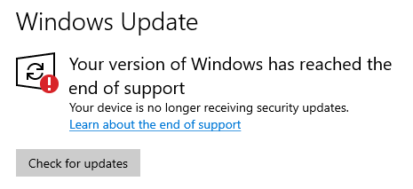

# Troubleshoot

## Activation / Change Edition Issues

- Ensure you are using the [latest MAS version](intro.md#how-to-activate-windows--office--extended-updates-esu) for activation.  
- If the MAS script displays any **blue-colored lines**, follow the instructions shown there.  
- If the issue persists even after following the blue-line instructions, reach out to us with an error screenshot using one of the links below.  

:::tip

**Read and follow the blue lines in the script.**

---

**阅读并遵循脚本中的蓝色行指示。**  
**Читайте и следуйте синим линиям в сценарии.**  
**Leia e siga as linhas azuis no script.**  

:::

---

## Support Links

:::info[Support Links]

- [Discord](https://discord.gg/j2yFsV5ZVC) ❤️ (signup not required)  
- [GitHub](https://github.com/massgravel/Microsoft-Activation-Scripts/issues)  
- Email: `mas.help@outlook.com`  

import DiscordBadge from '@site/src/components/DiscordBadge';

<DiscordBadge />

:::

---

## Incorrect Status on the Windows Update Page for ESU and Windows 10 LTSC 2021

- [Why is the Windows Update page in Windows 10 Enterprise LTSC 2021 showing "Your device is no longer receiving security updates."?](faq.md#why-is-the-windows-update-page-in-windows-10-enterprise-ltsc-2021-showing-your-device-is-no-longer-receiving-security-updates)
- [I activated ESU with the TSforge, but the Windows Update page in Settings still saying "Your device is no longer receiving security updates." Why?](tsforge.md#windows-10-esu-faq)
- [How can I check if TSforge ESU is activated?](tsforge.md#windows-10-esu-faq)

---
