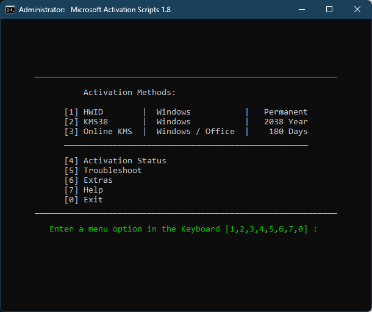
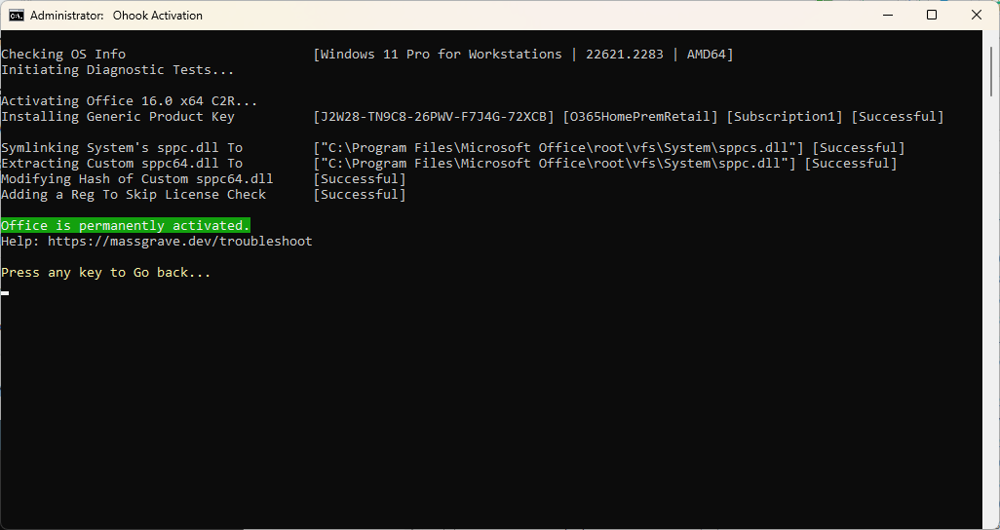

## Intro

**Microsoft Activation Scripts (MAS)**

A Windows and Office activator using HWID / Ohook / KMS38 / Online KMS activation methods, with a focus on open-source code and fewer antivirus detections.

------------------------------------------------------------------------

## Features

-   **HWID (Digital License)** Method to Permanently Activate Windows
-   **Ohook** Method to Permanently Activate Office
-   **KMS38** Method to Activate Windows/Server Till the Year 2038
-   **Online KMS** Method to Activate Windows/Server/Office Till 180 Days (Lifetime With Renewal Task)
-   Advanced Activation Troubleshoot
-   \$OEM\$ Folders For Preactivation
-   Change Windows Edition
-   Check Windows/Office Activation Status
-   Available in All In One and Separate Files Version
-   Fully Open Source and Based on Batch Script
-   Fewer Antivirus Detections

------------------------------------------------------------------------

## MAS Latest Release

Last Release - v2.1 (30-Sep-2023)\
[GitHub](https://github.com/massgravel/Microsoft-Activation-Scripts) / [Bitbucket](https://bitbucket.org/WindowsAddict/microsoft-activation-scripts)

------------------------------------------------------------------------

**Note: HWID Activation is not working, use KMS38 option for now\
**HWID activation is not working because of server-side changes at Microsoft. Use the KMS38 option for now. Your previously established HWID is safe. This happened because of [recent change](https://devicepartner.microsoft.com/en-us/communications/comm-windows-ends-installation-path-for-free-windows-7-8-upgrade) to not allow Windows 7/8 free upgrades.

## Download / How to use it?

### Method 1 - PowerShell

(Recommended)

-   On Windows 8.1/10/11, right-click on the Windows start menu and select PowerShell or Terminal (Not CMD).
-   Copy-paste the below code and press enter\
    `irm https://massgrave.dev/get | iex`
-   You will see the activation options, and follow onscreen instructions.
-   That's all.

### Method 2 - Traditional

-   Download the file from [here](https://github.com/massgravel/Microsoft-Activation-Scripts/archive/refs/heads/master.zip)
-   Right click on the downloaded zip file and extract
-   In the extracted folder, find the folder named `All-In-One-Version`
-   Run the file named `MAS_AIO.cmd`
-   You will see the activation options, and follow onscreen instructions.
-   That's all.

To run the scripts in unattended mode, check [here](command_line_switches.html)

------------------------------------------------------------------------

## Activations Summary

| Activation Type    | Supported Product    | Activation Period                    |
|:-----------------|:-------------------|:---------------------------------|
| HWID (Not working) | Windows 10-11        | Permanent                            |
| Ohook              | Office               | Permanent                            |
| KMS38              | Windows 10-11-Server | Till the Year 2038                   |
| Online KMS         | Windows / Office     | 180 Days. Lifetime With Renewal Task |

For more details, use the respective activation details in Doc.

To activate unsupported products such as **Office on Mac**, check [here](unsupported_products_activation.html).

------------------------------------------------------------------------

## Screenshots

------------------------------------------------------------------------

## Other Projects

-   [IDM Activation Script (IAS)](idm-activation-script.html)

------------------------------------------------------------------------

Made with Love ❤️
