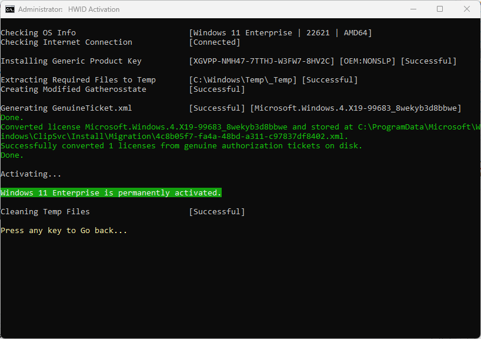

## Intro

**Microsoft Activation Scripts (MAS)**

A collection of scripts for activating Microsoft products using HWID / KMS38 / Online KMS activation methods with a focus on open-source code, fewer antivirus detection, and user-friendliness.

------------------------------------------------------------------------

## Features

-   HWID Activation
-   KMS38 Activation
-   Online KMS Activation
-   \$OEM\$ Folders For Preactivation
-   Activation Troubleshoot
-   Insert Windows 10-11 HWID Key
-   Change Windows 10-11-Server Edition
-   Check Windows-Office Activation Status
-   Available in All In One & Separate Files Version
-   Fully Open Source
-   Fewer antivirus detection
-   Files are either transparent batch script or Official Microsoft file

------------------------------------------------------------------------

## MAS Last Release

Last Release - v1.6 (25-July-2022)\
[GitHub](https://github.com/massgravel/Microsoft-Activation-Scripts) / [GitLab](https://gitlab.com/massgrave/microsoft-activation-scripts)

------------------------------------------------------------------------

## Download / How to use it?

### Method 1 - PowerShell

-   On Windows 10/11, right click on windows start menu, select PowerShell or Terminal.
-   Copy-paste the below code and press enter\
    `iwr -useb https://massgrave.dev/get | iex`
-   You will see the activation options, follow onscreen instructions.
-   That's all.

### Method 2 - Traditional

-   Download the file named `MAS_1.6_Password_1234.7z` from [here](https://github.com/massgravel/Microsoft-Activation-Scripts/releases)
-   Extract this file with a 3rd party archive manager, such as [7zip](https://www.7-zip.org/download.html)
-   Password is `1234`
-   In extracted folder, find the folder named `All-In-One-Version`
-   Run the file named `MAS_AIO.cmd`
-   You will see the activation options, follow onscreen instructions.
-   That's all.

------------------------------------------------------------------------

## Activations Summary

| Activation Type | Supported Product    | Activation Period                               |
|:----------------|:----------------|:-------------------------------------|
| HWID            | Windows 10-11        | Permanent                                       |
| KMS38           | Windows 10-11-Server | Until the year 2038                             |
| Online KMS      | Windows / Office     | 180 Days. Lifetime Activation With Renewal Task |

For more details, use the respective activation's details in Doc.

------------------------------------------------------------------------

## Screenshots

------------------------------------------------------------------------

Made with Love ❤️
